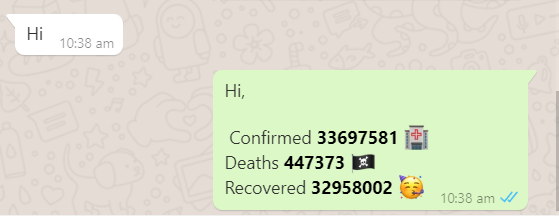

# wa-covid-bot

[](https://github.com/tterb/atomic-design-ui/blob/master/LICENSEs)

A whatsapp bot to show the current COVID-19 cases in India.

## Demo



## setup

```sh
$ git clone https://github.com/zaidajani/wa-covid-bot.git

$ cd wa-covid-bot

$ npm i

$ node index.js
```

#### Then on your phone, go to linked devices in the settings (ios) or web whatsapp on android navbar, and scan the QR code.

## Enjoy your powerfull bot.
